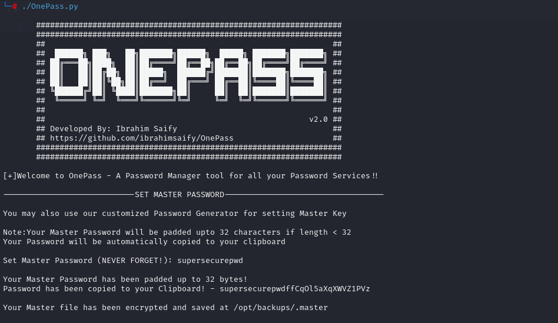
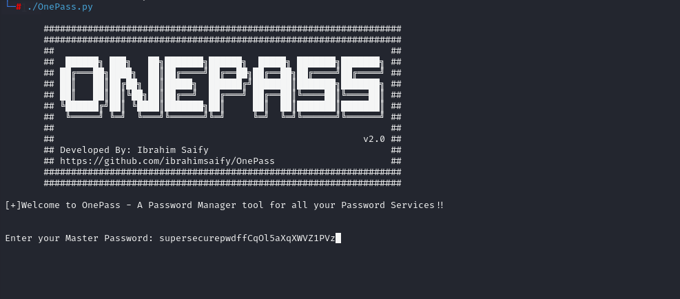
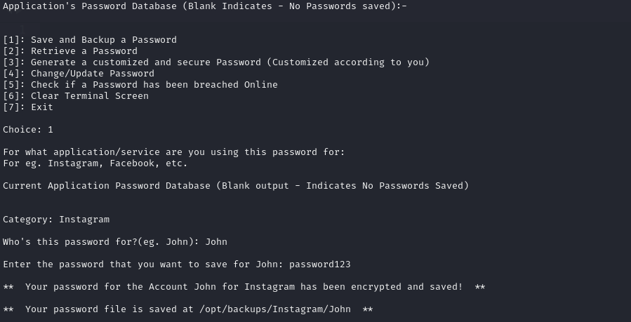
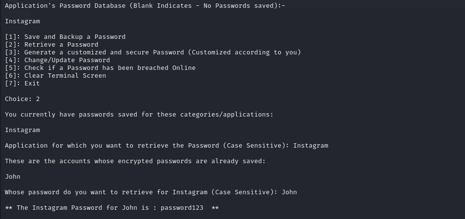
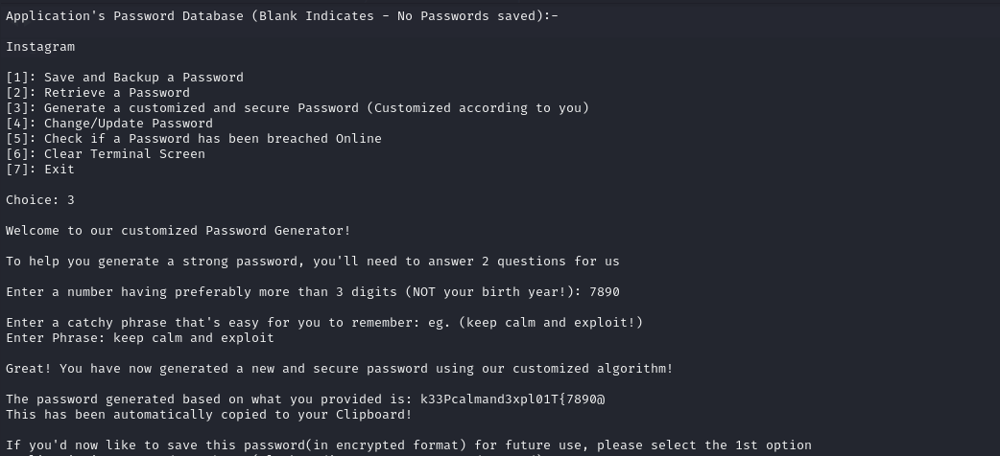
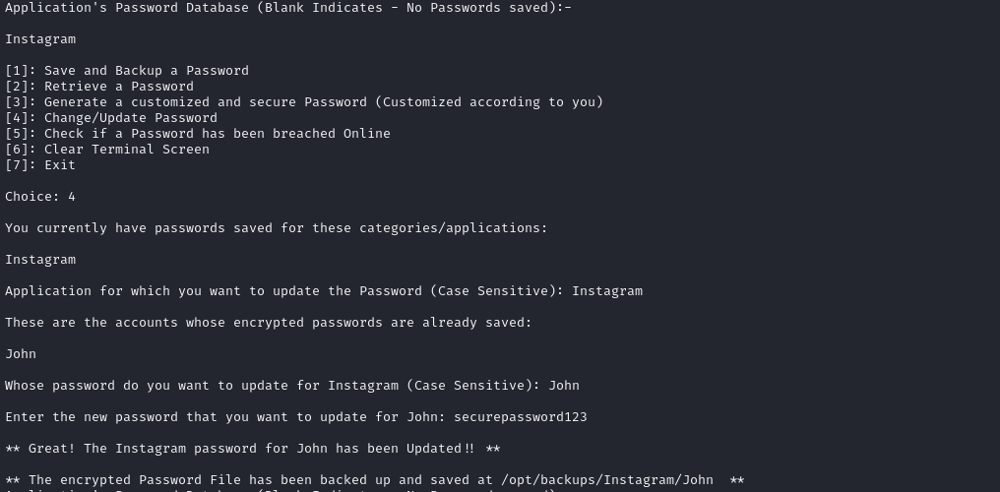
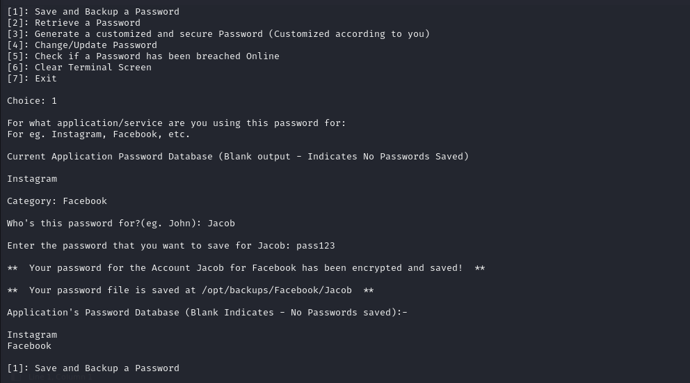
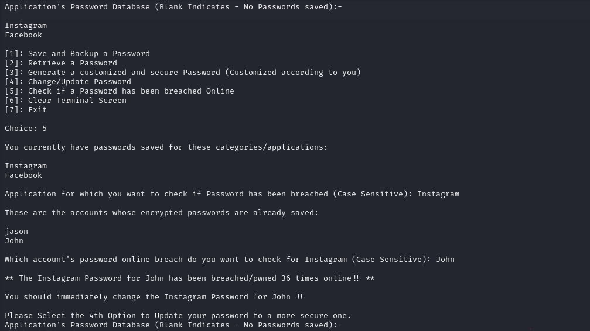
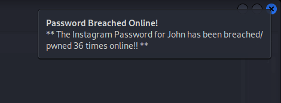

# OnePass - Password Manager Tool

**OnePass** is a Unix-based password manager tool designed to store your passwords for various applications in an encrypted format locally. It provides secure storage, retrieval, and updating of your passwords, as well as customized password generation and breach checking.

## Features

- **Encrypted Password Storage**: Store your passwords locally in an encrypted format.
- **Password Retrieval**: Retrieve stored passwords securely.
- **Customized Password Generation**: Generate strong, customized passwords.
- **Password Updating**: Update any saved password easily.
- **Breach Check**: Check if any of your stored passwords have been breached online.
- **Master Password**: Only one master password is required to access all services.
- **Clipboard Support**: The master password is copied to the clipboard upon initial setup.

## How It Works

1. **Initial Setup**: When you run the program for the first time, you will be prompted to set a master password. This master password will be used for all encryption and decryption operations.

2. **Subsequent Runs**: For all subsequent runs, you will be prompted to enter the master password to access the tool's functionalities.

3. **Encryption/Decryption**: The master password is used to encrypt and decrypt the password files. The plaintext master password is never stored; only hashes are used for verification.
4. **Password Management**: You can store, retrieve, update, and generate passwords using the tool.






5. **Breach Checking**: The tool can check if any stored passwords have been compromised online and sends you a notification if that password has been breached online.



## Installation

1. Clone the repository:
   ```sh
   git clone https://github.com/ibrahimsaify/OnePass.git
   ```
2. Navigate to the directory:
   ```sh
   cd OnePass
   ```
3. Install required dependencies:
   ```sh
   pip install -r requirements.txt
   ```
4. Make the script executable:
   ```sh
   chmod +x OnePass.py
   ```

## Usage

1. **Run the Script**:
   ```sh
   ./OnePass.py
   ```
2. **Set Master Password**: Follow the prompts to set your master password on the first run.
3. **Enter Master Password**: Enter your master password on subsequent runs to access the tool.
4. **Use the Features**: Store, retrieve, update, generate, and check passwords as needed.

## Default Backup Directory

The default backup directory is set to `/opt/backups`. You can change this directory if needed. If you encounter permission errors, run the script with `sudo` to ensure you have the necessary read/write permissions.

## Security

- **Master Password**: The master password is used for all encryption and decryption operations. It is never stored in plaintext; only hashes are compared to verify the master password.
- **Encryption**: All password files are encrypted using your master password, ensuring that your data remains secure.

## Dependencies

- Python 3.x
- `pycryptodome` for encryption
- `pyperclip` for clipboard support
- `requests` for breach checking

Install the dependencies using the provided `requirements.txt` file.

## Permissions

If you encounter permission issues, run the script with `sudo` to ensure proper read/write access to the necessary password files.

## License

This project is licensed under the GNU General Public License - see the [LICENSE](LICENSE) file for details.

## Contributing

Contributions are welcome! Please fork the repository and create a pull request with your changes.

## Contact

For questions or suggestions, please open an issue on GitHub or contact [ibrahim.saify110@gmail.com](mailto:ibrahim.saify110@gmail.com).

---
